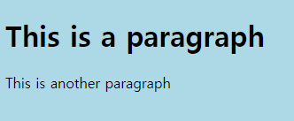

# CSS

## CSS란?

CSS는 HTML문서의 외형을 바꾸는데 사용된다.
CSS를 적용시키기 위해서는 2가지 방법이 있는데, 하나는 HTML 문서 내부에 `<style>` 태그를 사용하는 방법이고, 다른 하나는 외부의 CSS 파일을 HTML 문서에 연결하는 방법이다.

## CSS 사용법
CSS를 사용하기 위해서는, 위에 설명 했듯이 HTML 문서 내에서 `<style>`울 사용하여 적용하거나, 외부의 CSS 파일을 HTML 문서에 연결시켜서 적용시킬 수 있다.
`<style>` 태그는, HTML 문서의 `<head>` 안에 위치시키면 된다.
```html
<html>
    <head>
        <style>
            body {
                background-color: lightblue;
            }
        </style>
    </head>
    <body>
        ...
    </body>
```

외부 CSS 파일을 HTML 문서에 연결시키기 위해서는, `<link>` 태그를 사용한다.
```html
<html>
    <head>
        <link rel="stylesheet" href="style.css">
    </head>
    <body>
        ...
    </body>
```

또한, 인라인 CSS를 사용할 수도 있다. 인라인 CSS는 HTML 요소의 `style` 속성을 사용하여 적용시킬 수 있다.
```html
<html>
    <body style="background-color: lightblue;">
        <h1>This is a Blue Heading</h1>
        <p>This is a red paragraph.</p>
    </body>
</html>
```

## CSS 적용 예시

```css
body {
  background-color: lightblue;
}
```

```html
<body>
    <h1>This is a paragraph</h1>
    <p>This is another paragraph</p>
</body>
```

이런 식으로 CSS를 적용 시킬 경우, body 태그 안에 있는 모든 요소들의 배경색이 lightblue로 바뀐다.
위 코드는 다음과 같이 렌더링 된다.




## CSS 선택자
CSS 선택자는 CSS 규칙이 적용될 HTML 요소를 선택하는데 사용된다.
CSS 선택자는 다음과 같이 세가지로 나뉜다.

- HTML 요소 선택자
- HTML 요소의 id 선택자
- HTML 요소의 class 선택자

---
먼저, 그냥 HTML 요소 선택자는, HTML 요소의 이름을 사용하여 선택하는 방법이다. 위에 있는 예시가 이에 해당하는데, body 태그를 선택하여 배경색을 바꾸었다.

다른 방법인 id와 class 선택자들은, HTML 요소에 id와 class를 지정하여 선택하는 방법이다.

id와 class는 HTML 요소의 속성이며, 이는 각각 태그 안에 `id="id_name"`과 `class="class_name"`과 같이 지정할 수 있다.

id 선택자를 사용하기 위해서는 `#`을 사용하고, class 선택자를 사용하기 위해서는 `.`을 사용한다.
예를 들어서, `<p id="sampleID" class="sampleClass">` 이라는 태그에 각각 sampleID와 sampleClass라는 id와 class를 지정했다고 하자.
그럴 경우에, 다음과 같이 CSS를 적용시킬 수 있다.
    
    ```css 
    #sampleID {
        font-size: 20px;
    }

    .sampleClass {
        text-align: center;
    }
    ```

## CSS 애니메이션

CSS를 사용하면 애니메이션을 만들 수 있다.

```
p {
    transform: rotate(0deg);
     transform-origin: 100% 100%;
}
```

위와 같이 CSS를 적용시키면, p 태그가 0도에서 360도까지 회전하는 애니메이션을 만들 수 있다.


## Hover

CSS를 사용하면 마우스를 올렸을 때, 특정 요소의 스타일을 바꿀 수 있다.

```css
p:hover {
    background-color: red;
}
```

위와 같이 CSS를 적용시키면, 마우스를 p 태그 위에 올렸을 때, 배경색이 빨간색으로 바뀐다.


[돌아가기](/README.md)
