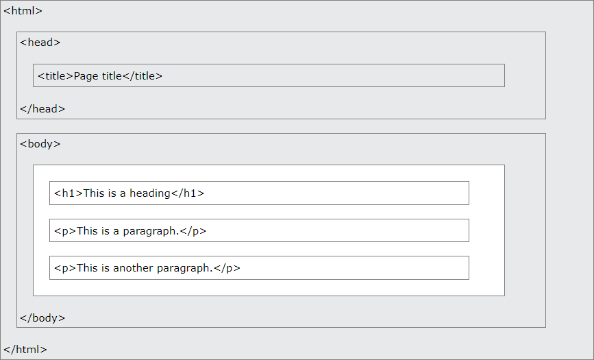

# HTML 스터디

## HTML 이란?

HTML은 Hyper Text Markup Language의 약자이다. 웹 페이지를 제작 하는데 가장 기본이 되는 Markup Language이다. HTML은 여러 element를 통해 웹 페이지의 구성을 나타내도록 한다.

예시 html:

```html
<!DOCTYPE html>
<html>
<head>
<title>Page Title</title>
</head>
<body>

<h1>My First Heading</h1>
<p>My first paragraph.</p>

</body>
</html>
```

여러 구성원들이 <> 태그 안에 들어가 있는 것을 볼 수 있다. 하나씩 설명 하자면:

| 태그                | 설명                                                       |
| ------------------- | ---------------------------------------------------------- |
| `<!DOCTYPE html>` | 해당 문서가 HTML5 문서임을 선언한다                        |
| `<html>`          | HTML 페이지의 가장 기본이 되는 구성원                      |
| `<head>`          | 해당 HTML 페이지의 메타 데이터를 가지고 있다               |
| `<title>`         | HTML 페이지의 제목을 지저한다                              |
| `<body>`          | 문서의 바디, 즉 보여 질 모든 컨텐츠 등이 담겨있는 컨테이너 |
| `<h1>`            | 큰 헤딩을 담는 태그                                        |
| `<p1>`            | 구절을 담는 태그                                           |

### HTML Element

한 html의 구성원은 시작 태그, 내용 및 끝나는 태그 이 세가지로 이루워져 있다..

```
<tagname> Content goes here... </tagname>
```

### Web Browsers

웹 브라우저는 HTML 문서를 읽고, 렌더링하여 사용자에게 보여준다. 대표적인 웹 브라우저로는 크롬, 파이어폭스, 사파리, 익스플로러 등이 있다.


### HTML 페이지의 구조

HTML 페이지는 다음과 같은 구조를 가지고 있다.



## 많이 쓰이는 HTML 태그

### `<a>` 태그

`<a>` 태그는 링크를 만드는 태그이다. 다음과 같이 사용한다.

```html
<a href="https://www.w3schools.com">This is a link</a>
```

위 코드는 다음과 같이 렌더링 된다.

<a href="https://www.w3schools.com">This is a link </a>

### `` 태그

`` 태그는 이미지를 삽입하는 태그이다. 다음과 같이 사용한다.

```html

```

위 코드는 다음과 같이 렌더링 된다.


### `<table>` 태그

`<table>` 태그는 테이블을 만드는 태그이다. 다음과 같이 사용한다.

```html

<table>
  <tr>
    <th>Firstname</th>
    <th>Lastname</th>
    <th>Age</th>
  </tr>
  <tr>
    <td>Jill</td>
    <td>Smith</td>
    <td>50</td>
  </tr>
  <tr>
    <td>Eve</td>
    <td>Jackson</td>
    <td>94</td>
  </tr>

</table>

```

위 코드는 다음과 같이 렌더링 된다.

<table>
  <tr>
    <th>Firstname</th>
    <th>Lastname</th>
    <th>Age</th>
  </tr>
  <tr>
    <td>Jill</td>
    <td>Smith</td>
    <td>50</td>
  </tr>
  <tr>
    <td>Eve</td>
    <td>Jackson</td>
    <td>94</td>
  </tr>
