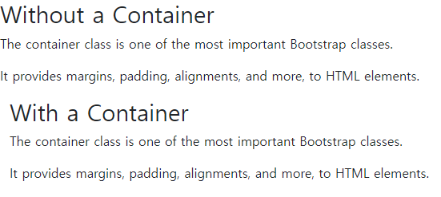
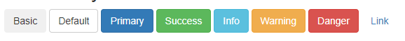

# Bootstrap
## 1. Bootstrap이란?

Bootstrap, 부트스트랩은 CSS framework로 responsive 웹페이지를 제작 하는데 유용하게 사용된다. Responsive 웹페이지란, 사용자의 화면 크기에 따라 화면에 보여지는 요소들의 크기가 변하는 웹페이지를 말한다. 컴퓨터 화면으로 봤을 때와 핸드폰 화면으로 봤을 때의 모습이 다른 것이 대표적인 예시이다.

## 2. Bootstrap 사용법

부트스트랩을 사용하기 위해서는, html 요소 안에 적절한 태그를 사용하면 된다. 이런 태그 들은 부트스트랩에서 제공하는 클래스를 사용하여 디자인을 적용할 수 있다. 
대표로 Bootstrap Container, Bootstrap Grid System, Bootstrap Button 등이 있다.

### Bootstrap Container

Container 클래스는 부트스트랩 클래스 중 가장 중요한 것 중 하나로, HTML 요소들에게 마진, 패딩 등 다양한 css를 적용시켜 준다.
    
``` html
<!DOCTYPE html>
<html lang="en">
<head>
  <title>Bootstrap Example</title>
  <meta charset="utf-8">
  <meta name="viewport" content="width=device-width, initial-scale=1">
  <link href="https://cdn.jsdelivr.net/npm/bootstrap@5.1.1/dist/css/bootstrap.min.css" rel="stylesheet">
  <script src="https://cdn.jsdelivr.net/npm/bootstrap@5.1.1/dist/js/bootstrap.bundle.min.js"></script>
</head>
<body>

<div> 
  <h2>Without a Container</h2>
  <p>The container class is one of the most important Bootstrap classes.</p>
  <p>It provides margins, padding, alignments, and more, to HTML elements.</p>
</div>

<div class="container-fluid"> 
  <h2>With a Container</h2>
  <p>The container class is one of the most important Bootstrap classes.</p>
  <p>It provides margins, padding, alignments, and more, to HTML elements.</p>
</div>

</body>
</html>
```

이 코드는 다음과 같이 렌더링 된다




### Bootstrap Grid System

부트스트랩은 Grid 시스템은 responsive이며, 화면에 구간을 나눈다고 생각하면 됩니다. 한 행에는 12개의 구간이 있으며, 이를 이용하여 화면을 나눌 수 있습니다. 
    
```html
<div class="row">
  <div class="col-*-*"></div>
  <div class="col-*-*"></div>
</div>
<div class="row">
  <div class="col-*-*"></div>
  <div class="col-*-*"></div>
  <div class="col-*-*"></div>
</div>
<div class="row">
  ...
</div>
```
`col-*-*` 안에는 col-`Grid Class`-`Size`로 선언이 가능하다. Grid Class는 총 4가지가 있으며, 조합을 잘 사용하여 유연한 화면을 만들 수 있다.

#### Grid Class
1. xs (for phones - screens less than 768px wide)
1. sm (for tablets - screens equal to or greater than - 768px wide)
1. md (for small laptops - screens equal to or greater than 992px wide)
1. lg (for laptops and desktops - screens equal to or greater than 1200px wide)

앞서 말했듯이, 한 행 안에는 12개의 구간이 있고, 이 12개는 무조건 다 채워져야 한다. 

- 1-1-1-...-1-1-1
- 4-4-4
- 4-8
- 3-3-6
- 12

이런 식으로 12개의 구간을 채워야 한다. 

### Bootstrap Button

부트스트랩에서는 버튼을 쉽게 디자인 할 수 있도록 클래스를 제공한다. 

```html
<button type="button" class="btn btn-primary">Primary</button>
<button type="button" class="btn btn-secondary">Secondary</button>
<button type="button" class="btn btn-success">Success</button>
<button type="button" class="btn btn-danger">Danger</button>
<button type="button" class="btn btn-warning">Warning</button>
<button type="button" class="btn btn-info">Info</button>
<button type="button" class="btn btn-light">Light</button>
<button type="button" class="btn btn-dark">Dark</button>
<button type="button" class="btn btn-link">Link</button>
```

이런 식으로 버튼을 디자인 할 수 있다. 이 버튼들은 다음과 같이 렌더링 된다.



링크 버튼 경우에는, `<a href="#" class="btn btn-link">Link</a>` 이런 식으로, href 속성을 추가해주어야 한다. 이때, # 대신에 링크를 삽입하면 된다.

---

부트스트랩은 이외에도 다양한 클래스를 제공한다. 이를 이용하여 웹페이지를 디자인 할 수 있다. [W3School 부트스트랩 튜토리얼](https://www.w3schools.com/bootstrap/default.asp) 웹페이지에 가면, Container, Grid, Button 외에도 다양한 클래스를 확인할 수 있다.


[돌아가기](/README.md)